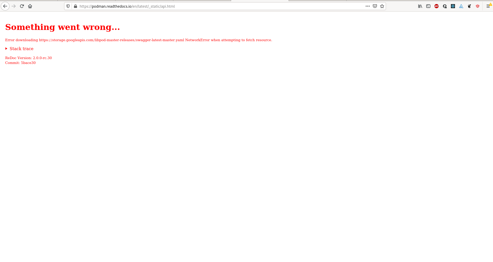

# Podman Documentation

The online man pages and other documents regarding Podman can be found at
[Read The Docs](https://podman.readthedocs.io).  The man pages
can be found under the [Commands](https://podman.readthedocs.io/en/latest/Commands.html)
link on that page.

# Build the Docs

## Directory Structure

|                                      | Directory                   |
| ------------------------------------ | --------------------------- |
| Markdown source for man pages        | docs/source/markdown/       |
| man pages aliases as .so files       | docs/source/markdown/links/ |
| target for output                    | docs/build                  |
| man pages                            | docs/build/man              |
| remote linux man pages               | docs/build/remote/linux     |
| remote darwin man pages              | docs/build/remote/darwin    |
| remote windows html pages            | docs/build/remote/windows   |

## Support files

| | |
| ------------------------------------ | --------------------------- |
| docs/remote-docs.sh | Read the docs/source/markdown files and format for each platform |
| docs/links-to-html.lua | pandoc filter to do aliases for html files |
| docs/use-pagetitle.lua | pandoc filter to set html document title |

## Manpage Syntax

The syntax for the formatting of all man pages can be found [here](MANPAGE_SYNTAX.md).

## API Reference

The [latest online documentation](http://docs.podman.io/en/latest/_static/api.html) is
automatically generated by two cooperating automation systems based on committed upstream
source code.  Firstly, [the Cirrus-CI docs task](../contrib/cirrus/README.md#docs-task) builds
`pkg/api/swagger.yaml` and uploads it to a public-facing location (Google Storage Bucket -
an online service for storing unstructured data).  Second, [Read The Docs](readthedocs.com)
reacts to the github.com repository change, building the content for the [libpod documentation
site](https://podman.readthedocs.io/).  This site includes for the API section,
some javascript which consumes the uploaded `swagger.yaml` file directly from the Google
Storage Bucket.

Since there are multiple systems and local cache is involved, it's possible that updates to
documentation (especially the swagger/API docs) will lag by 10-or-so minutes.  However,
because the client (i.e. your web browser) is fetching content from multiple locations that
do not share a common domain, accessing the API section may show a stack-trace similar to
the following:



If reloading the page, or clearing your local cache does not fix the problem, it is
likely caused by broken metadata needed to protect clients from cross-site-scripting
style attacks.  Please [notify a maintainer](https://github.com/containers/podman#communications)
so they may investigate how/why the `swagger.yaml` file's CORS-metadata is
incorrect, or the file isn't accessible for some other reason.

## Local Testing

To build standard man pages, run `make docs`. Results will be in `docs/build/man`.

To build HTMLized man pages: Assuming that you have the
[dependencies](https://podman.io/getting-started/installation#build-and-run-dependencies)
installed, then also install (showing Fedora in the example):

```
$ sudo dnf install python3-sphinx python3-recommonmark
$ pip install sphinx-markdown-tables myst_parser
```
(The above dependencies are current as of 2022-09-15. If you experience problems,
please see [requirements.txt](requirements.txt) in this directory, it will almost
certainly be more up-to-date than this README.)

After that completes, cd to the `docs` directory in your Podman sandbox and then do `make html`.

You can then preview the html files in `docs/build/html` with:
```
python -m http.server 8000 --directory build/html
```
...and point your web browser at `http://localhost:8000/`
