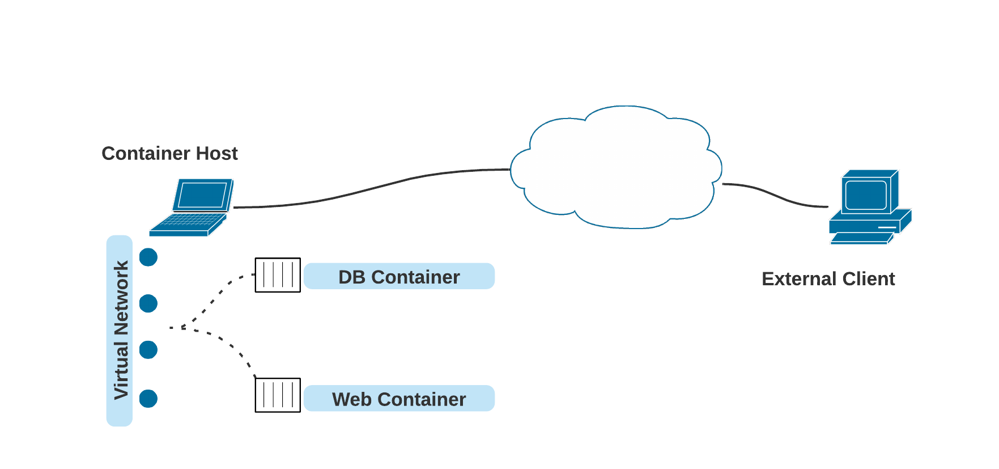
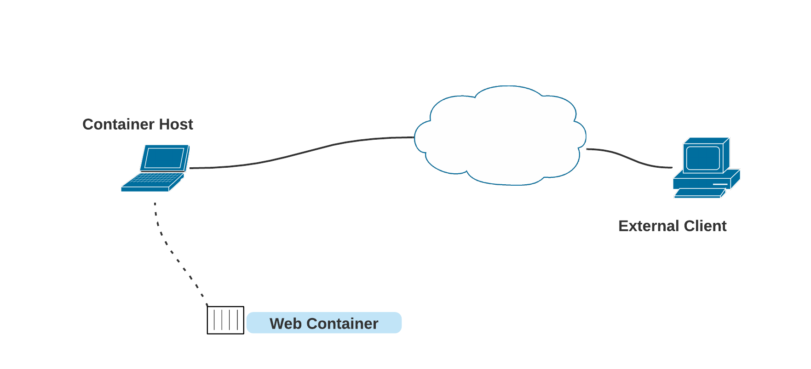
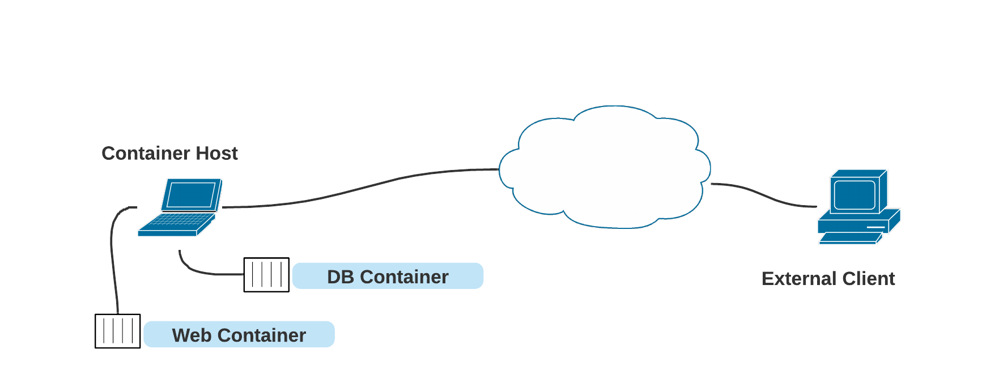

# Basic Networking Guide for Podman


It seems once people master the basics of containers, networking is one of the first
aspects they begin experimenting with.  And regarding networking, it takes very
little experimentation before ending up on the deep end of the pool.  The following
guide shows the most common network setups for Podman rootful and rootless containers.
Each setup is supported with an example.


## Differences between rootful and rootless container networking

One of the guiding factors on networking for containers with Podman is going to
be whether or not the container is run by a root user or not. This is because
unprivileged users cannot create networking interfaces on the host. Therefore,
for rootless containers, the default network mode is slirp4netns. Because of the
limited privileges, slirp4netns lacks some of the features of networking
compared to rootful Podman's networking; for example, slirp4netns cannot give
containers a routable IP address. The default networking mode for rootful
containers on the other side is netavark, which allows a container to have a
routable IP address.

## Firewalls

The role of a firewall will not impact the setup and configuration of networking,
but it will impact traffic on those networks.  The most obvious is inbound network
traffic to the container host, which is being passed onto containers usually with
port mapping.  Depending on the firewall implementation, we have observed firewall
ports being opened automatically due to running a container with a port mapping (for
example).  If container traffic does not seem to work properly, check the firewall
and allow traffic on ports the container is using. A common problem is that
reloading the firewall deletes the cni/netavark iptables rules resulting in a loss of
network connectivity for rootful containers. Podman v3 provides the podman
network reload command to restore this without having to restart the container.

## Basic Network Setups

Most containers and pods being run with Podman adhere to a couple of simple scenarios.
By default, rootful Podman will create a bridged network.  This is the most straightforward
and preferred network setup for Podman. Bridge networking creates an interface for
the container on an internal bridge network, which is then connected to the internet
via Network Address Translation(NAT).  We also see users wanting to use `macvlan`
for networking as well. The `macvlan` plugin forwards an entire network interface
from the host into the container, allowing it access to the network the host is connected
to. And finally, the default network configuration for rootless containers is slirp4netns.
The slirp4netns network mode has limited capabilities but can be run on users without
root privileges. It creates a tunnel from the host into the container to forward
traffic.

### Bridge

A bridge network is defined as an internal network is created where both the
container and host are attached.  Then this network is capable of allowing the containers
to communicate outside the host.




Consider the above illustration.  It depicts a laptop user running two containers:
a web and db instance.  These two containers are on the virtual network with the
host.  Additionally, by default, these containers can initiate communications outside
the laptop (to the Internet for example).  The containers on the virtual network
typically have non-routable, also known as private IP addresses.

When dealing with communication that is being initiated outside the host, the outside
client typically must address the laptop’s external network interface and given port
number.  Assuming the host allows incoming traffic, the host will know to forward
the incoming traffic on that port to the specific container.  To accomplish this,
firewall rules are added to forward traffic when a container requests a specific
port be forwarded.

Bridge networking is the default for Podman containers created as root. Podman provides
a default bridge network, but you can create others using the `podman network create`
command. Containers can be joined to a network when they are created with the
`--network` flag, or after they are created via the `podman network connect` and
`podman network disconnect` commands.

As mentioned earlier, slirp4netns is the default network configuration for rootless
users.  But as of Podman version 4.0, rootless users can also use netavark.
The user experience of rootless netavark is very akin to a rootful netavark, except that
there is no default network configuration provided.  You simply need to create a
network, and the one will be created as a bridge network. If you would like to switch from
CNI networking to netavark, you must issue the `podman system reset --force` command.
This will delete all of your images, containers, and custom networks.

```
$ podman network create
```

When rootless containers are run, network operations
will be executed inside an extra network namespace. To join this namespace, use
`podman unshare --rootless-netns`.

#### Default Network

The default network `podman` with netavark is memory-only.  It does not support dns resolution because of backwards compatibility with Docker.  To change settings, export the in-memory network and change the file.

For the default rootful network use
```
podman network inspect podman | jq .[] > /etc/containers/networks/podman.json
```

And for the rootless network use

```
podman network inspect podman | jq .[] > ~/.local/share/containers/storage/networks/podman.json
```


#### Example

By default, rootful containers use the netavark for its default network if
you have not migrated from Podman v3.
In this case, no network name must be passed to Podman.  However, you can create
additional bridged networks with the podman create command.

The following example shows how to set up a web server and expose it to the network
outside the host as both rootful and rootless.  It will also show how an outside
client can connect to the container.

```
(rootful) $ sudo podman run -dt --name webserver -p 8080:80 quay.io/libpod/banner
00f3440c7576aae2d5b193c40513c29c7964e96bf797cf0cc352c2b68ccbe66a
```

Now run the container.
```
$ podman run -dt --name webserver --net cni-podman1 -p 8081:80 quay.io/libpod/banner
269fd0d6b2c8ed60f2ca41d7beceec2471d72fb9a33aa8ca45b81dc9a0abbb12
```
Note in the above run command, the container’s port 80 (where the Nginx server is
running) was mapped to the host’s port 8080.  Port 8080 was chosen to demonstrate
how the host and container ports can be mapped for external access.  The port could
very well have been 80 as well (except for rootless users).

To connect from an outside client to the webserver, simply point an HTTP client to
the host’s IP address at port 8080 for rootful and port 8081 for rootless.
```
(outside_host): $ curl 192.168.99.109:8080
   ___           __
  / _ \___  ___/ /_ _  ___ ____
 / ___/ _ \/ _  /  ' \/ _ `/ _ \
/_/   \___/\_,_/_/_/_/\_,_/_//_/

(outside_host): $ curl 192.168.99.109:8081
   ___           __
  / _ \___  ___/ /_ _  ___ ____
 / ___/ _ \/ _  /  ' \/ _ `/ _ \
/_/   \___/\_,_/_/_/_/\_,_/_//_/
```

### Macvlan

With macvlan, the container is given access to a physical network interface on the
host. This interface can configure multiple subinterfaces.  And each subinterface
is capable of having its own MAC and IP address.  In the case of Podman containers,
the container will present itself as if it is on the same network as the host.



In the illustration, outside clients will be able to access the web container by
its IP address directly.  Usually the network information, including IP address,
is leased from a DHCP server like most other network clients on the network.  If
the laptop is running a firewall, such as firewalld, then accommodations will need
to be made for proper access.

#### Example

The following example demonstrates how to set up a web container on a macvlan and
how to access that container from outside the host.  First, create the macvlan network.
 You need to know the network interface on the host that connects to the routable
network.  In the example case, it is eth0.  In Podman v4.0 if you need to use a leasable
address, you should continue to use CNI instead of netavark.

```
$ sudo podman network create -d macvlan -o parent=eth0 webnetwork
webnetwork
```
The next step is to ensure that the DHCP CNI plugin is running.  This plugin facilitates
the DHCP lease from the network.
```
$ sudo /usr/libexec/cni/dhcp daemon
```
Now run the container and be certain to attach it to the network we created earlier.
```
$ sudo podman run -dt --name webserver --network webnetwork quay.io/libpod/banner
03d82083c434d7e937fc0b87c25401f46ab5050007df403bf988e25e52c5cc40
[baude@localhost ~]$ sudo podman exec webserver ip address show eth0
2: eth0@if3: <BROADCAST,MULTICAST,UP,LOWER_UP,M-DOWN> mtu 1500 qdisc noqueue state
UP
link/ether 0a:3c:e2:eb:87:0f brd ff:ff:ff:ff:ff:ff
inet 192.168.99.186/24 brd 192.168.99.255 scope global eth0
valid_lft forever preferred_lft forever
inet6 fe80::83c:e2ff:feeb:870f/64 scope link
valid_lft forever preferred_lft forever
```
Because the container has a routable IP address (on this network) and is not being
managed by firewalld, no change to the firewall is needed.
```
(outside_host): $ curl http://192.168.99.186
   ___           __
  / _ \___  ___/ /_ _  ___ ____
 / ___/ _ \/ _  /  ' \/ _ `/ _ \
/_/   \___/\_,_/_/_/_/\_,_/_//_/
```


### Slirp4netns

Slirp4netns is the default network setup for rootless containers and pods.  It was
invented because unprivileged users are not allowed to make network interfaces on
the host.  Slirp4netns creates a TAP device in the container’s network namespace
and connects to the usermode TCP/IP stack.  Consider the following illustration.



The unprivileged user on this laptop has created two containers: a DB container and
a web container.  Both of these containers have the ability to access content on
networks outside the laptop.  And outside clients can access the containers if the
container is bound to a host port and the laptop firewall allows it.  Remember, unprivileged
users must use ports 1024 through 65535 as lower ports require root privileges. (CAP_NET_BIND_SERVICE)
Note: this can be adjusted using the `sysctl net.ipv4.ip_unprivileged_port_start`

One of the drawbacks of slirp4netns is that the containers are completely isolated
from each other.  Unlike the bridge approach, there is no virtual network.  For containers
to communicate with each other, they can use the port mappings with the host system,
or they can be put into a Pod where they share the same network namespace. See [Communicating
between containers and pods](#Communicating-between-containers-and-pods) for more information.

#### Example

The following example will show how two rootless containers can communicate with
each other where one is a web server.  Then it will show how a client on the host’s
network can communicate with the rootless web server.

First, run the rootless web server and map port 80 from the container to a non-privileged
port like 8080.
```
$ podman run -dt --name webserver -p 8080:80 quay.io/libpod/banner
17ea33ccd7f55ff45766b3ec596b990a5f2ba66eb9159cb89748a85dc3cebfe0
```
Because rootless containers cannot communicate with each other directly with TCP/IP
via IP addresses, the host and the port mapping are used.  To do so, the IP address
of the host (interface) must be known.
```
$ ip address show eth0
3: eth0: <BROADCAST,MULTICAST,UP,LOWER_UP> mtu 1500 qdisc fq_codel state UP group
default qlen 1000
link/ether 3c:e1:a1:c1:7a:3f brd ff:ff:ff:ff:ff:ff
altname eth0
inet 192.168.99.109/24 brd 192.168.99.255 scope global dynamic noprefixroute eth0
valid_lft 78808sec preferred_lft 78808sec
inet6 fe80::5632:6f10:9e76:c33/64 scope link noprefixroute
valid_lft forever preferred_lft forever
```
From another rootless container, use the host’s IP address and port to communicate
between the two rootless containers successfully.
```
$ podman run -it quay.io/libpod/banner curl http://192.168.99.109:8080
   ___           __
  / _ \___  ___/ /_ _  ___ ____
 / ___/ _ \/ _  /  ' \/ _ `/ _ \
/_/   \___/\_,_/_/_/_/\_,_/_//_/
```

From a client outside the host, the IP address and port can also be used:
```
(outside_host): $ curl http://192.168.99.109:8080
   ___           __
  / _ \___  ___/ /_ _  ___ ____
 / ___/ _ \/ _  /  ' \/ _ `/ _ \
/_/   \___/\_,_/_/_/_/\_,_/_//_/
```

## Communicating between containers and pods

Most users of containers have a decent understanding of how containers communicate
with each other and the rest of the world.  Usually each container has its own IP
address and networking information.  They communicate amongst each other using regular
TCP/IP means like IP addresses or, in many cases, using DNS names often based on
the container name.  But pods are a collection of one or more containers, and with
that, some uniqueness is inherited.

By definition, all containers in a Podman pod share the same network namespace. This
fact means that they will have the same IP address, MAC addresses, and port mappings.
You can conveniently communicate between containers in a pod by using localhost.


The above illustration describes a Pod on a bridged network.  As depicted, the Pod
has two containers “inside” it: a DB and a Web container.  Because they share the
same network namespace, the DB and Web container can communicate with each other
using localhost (127.0.0.1).  Furthermore, they are also both addressable by the
IP address (and DNS name if applicable) assigned to the Pod itself.

For more information on container to container networking, see [Configuring container
networking with Podman](https://www.redhat.com/sysadmin/container-networking-podman).
