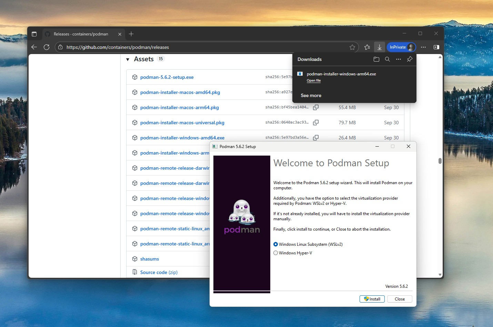
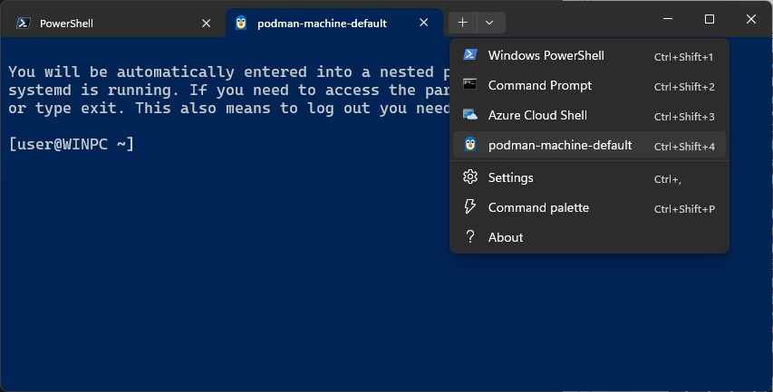

Podman for Windows
==================

While "containers are Linux," Podman also runs on Mac and Windows, where it
provides a native CLI and embeds a guest Linux system to launch your
containers. This guest is referred to as a Podman machine and is managed with
the `podman machine` command. On Windows, each Podman machine is backed by a
virtualized Windows Subsystem for Linux (WSLv2) distribution. The podman command
can be run directly from your Windows PowerShell (or CMD) prompt, where it
remotely communicates with the podman service running in the WSL environment.
Alternatively, you can access Podman directly from the WSL instance if you
prefer a Linux prompt and Linux tooling. In addition to command-line access,
Podman also listens for Docker API clients, supporting direct usage of
Docker-based tools and programmatic access from your language of choice.

Prerequisites
-------------

Since Podman uses WSL, you need a recent release of Windows 10 or Windows 11.
On x64, WSL requires build 18362 or later, and 19041 or later is required for
arm64 systems. Internally, WSL uses virtualization, so your system must
support and have hardware virtualization enabled. If you are running Windows
on a VM, you must have a VM that supports nested virtualization.

It is also recommended to install the modern "Windows Terminal," which
provides a superior user experience to the standard PowerShell and CMD
prompts, as well as a WSL prompt, should you want it.

You can install it by searching the Windows Store or by running the following
`winget` command:

`winget install Microsoft.WindowsTerminal`


Installing Podman
-----------------

Installing the Windows Podman client begins by downloading the Podman Windows
installer. The Windows installer is built with each Podman release and can be
downloaded from the official
 [GitHub release page](https://github.com/containers/podman/releases).
Be sure to download a 4.1 or later release for the capabilities discussed
in this guide.



Once downloaded, simply run the EXE file, and relaunch a new terminal. After
this point, podman.exe will be present on your PATH, and you will be able to run
the `podman machine init` command to create your first machine.

`PS C:\Users\User> podman machine init`

Automatic WSL Installation
--------------------------

If WSL has not been installed on your system, the first machine init command
will prompt a dialog to begin an automated install. If accepted, this process
will install the necessary Windows components, restart the system, and after
login, relaunch the machine creation process in a terminal window. Be sure to
wait a minute or two for the relaunch to occur, as Windows has a delay before
executing startup items. Alternatively, you can decline automatic installation
and install WSL manually. However, this will require additional download and
setup time.

Machine Init Process
--------------------

After WSL is installed, the init command will install a minimal installation
of Fedora, customizing it to run podman.

```
PS C:\Users\User> podman machine init
Extracting compressed file
Importing operating system into WSL (this may take 5+ minutes on a new WSL install)...
Installing packages (this will take a while)...
Complete!
Configuring system...
Generating public/private ed25519 key pair.
Your identification has been saved in podman-machine-default
Your public key has been saved in podman-machine-default.pub
The key fingerprint is:
SHA256:RGTGg2Q/LX7ijN+mzu8+BzcS3cEWP6Hir6pYllJtceA root@WINPC
Machine init complete
To start your machine run:

        podman machine start
```


Starting Machine
----------------

After the machine init process completes, it can then be started and stopped
as desired:

```
PS C:\Users\User> podman machine start

Starting machine "podman-machine-default"

This machine is currently configured in rootless mode. If your containers
require root permissions (e.g. ports < 1024), or if you run into compatibility
issues with non-podman clients, you can switch using the following command:

        podman machine set --rootful

API forwarding listening on: npipe:////./pipe/docker_engine

Docker API clients default to this address. You do not need to set DOCKER_HOST.
Machine "podman-machine-default" started successfully
```

First Podman Command
--------------------

From this point on, podman commands operate similarly to how they would on
Linux.

For a quick working example with a small image, you can run the Linux date
command on PowerShell.

```
PS C:\Users\User> podman run ubi8-micro date
Thu May 5 21:56:42 UTC 2022
```

Port Forwarding
---------------

Port forwarding also works as expected; ports will be bound against localhost
(127.0.0.1). Note: When running as rootless (the default), you must use a port
greater than 1023. See the Rootful and Rootless section for more details.

To launch httpd, you can run:

```
PS C:\Users\User> podman run --rm -d -p 8080:80 --name httpd docker.io/library/httpd
f708641300564a6caf90c145e64cd852e76f77f6a41699478bb83a162dceada9
```

A curl command against localhost on the PowerShell prompt will return a
successful HTTP response:

```
PS C:\Users\User> curl http://localhost:8080/ -UseBasicParsing

StatusCode : 200
StatusDescription : OK
Content : <html><body><h1>It works!</h1></body></html>
```

As with Linux, to stop, run:

`podman stop httpd`


Using API Forwarding
--------------------

API forwarding allows Docker API tools and clients to use podman as if it was
Docker. Provided there is no other service listening on the Docker API pipe;
no special settings will be required.

```
PS C:\Users\User> .\docker.exe run -it fedora echo "Hello Podman!"
Hello Podman!
```

Otherwise, after starting the machine, you will be notified of an environment
variable you can set for tools to point to podman. Alternatively, you can shut
down both the conflicting service and podman, then finally run `podman machine
start` to restart, which should grab the Docker API address.


```
Another process was listening on the default Docker API pipe address.
You can still connect Docker API clients by setting DOCKER HOST using the
following PowerShell command in your terminal session:

        $Env:DOCKER_HOST = 'npipe:////./pipe/podman-machine-default'

Or in a classic CMD prompt:

        set DOCKER_HOST=npipe:////./pipe/podman-machine-default

Alternatively, terminate the other process and restart podman machine.
Machine "podman-machine-default" started successfully

PS C:\Users\User> $Env:DOCKER_HOST = 'npipe:////./pipe/podman-machine-default'
PS C:\Users\User>.\docker.exe version --format '{{(index .Server.Components 0).Name}}'
Podman Engine
```

Rootful & Rootless
------------------

On the embedded WSL Linux distro, podman can either be run under the root user
(rootful) or a non-privileged user (rootless). For behavioral consistency with
Podman on Linux, rootless is the default. Note: Rootful and Rootless
containers are distinct and isolated from one another. Podman commands against
one (e.g., podman ps) will not represent results/state for the other.

While most containers run fine in a rootless setting, you may find a case
where the container only functions with root privileges. If this is the case,
you can switch the machine to rootful by stopping it and using the set
command:

```
podman machine stop
podman machine set --rootful
```

To restore rootless execution, set rootful to false:

```
podman machine stop
podman machine set --rootful=false
```

Another case in which you may wish to use rootful execution is binding a port
less than 1024. However, future versions of podman will likely drop this to a
lower number to improve compatibility with defaults on system port services (such
as MySQL)

Volume Mounting
---------------

New in Podman v4.1 is the ability to perform volume mounts from Windows paths into a
Linux container. This supports several notation schemes, including:

Windows Style Paths:

`podman run --rm -v c:\Users\User\myfolder:/myfolder ubi8-micro ls /myfolder`

Unixy Windows Paths:

`podman run --rm -v /c/Users/User/myfolder:/myfolder ubi8-micro ls /myfolder`

Linux paths local to the WSL filesystem:

`podman run --rm -v /var/myfolder:/myfolder ubi-micro ls /myfolder`

All of the above conventions work, whether running on a Windows prompt or the
WSL Linux shell. Although when using Windows paths on Linux, appropriately quote
or escape the Windows path portion of the argument.


Listing Podman Machine(s)
-------------------------

To list the available podman machine instances and their current resource
usage, use the `podman machine ls` command:

```
PS C:\Users\User> podman machine ls


NAME                    VM TYPE     CREATED      LAST UP            CPUS        MEMORY      DISK SIZE
podman-machine-default  wsl         2 hours ago  Currently running  4           331.1MB     768MB
```

Since WSL shares the same virtual machine and Linux kernel across multiple
distributions, the CPU and Memory values represent the total resources shared
across running systems. The opposite applies to the Disk value. It is
independent and represents the amount of storage for each individual
distribution.


Accessing the Podman Linux Environment
--------------------------------------

While using the podman.exe client on the Windows environment provides a
seamless native experience supporting the usage of local desktop tools and
APIs, there are a few scenarios in which you may wish to access the Linux
environment:

+ Updating to the latest stable packages on the embedded Fedora instance
+ Using Linux development tools directly
+ Using a workflow that relies on EXT4 filesystem performance or behavior
  semantics

There are three mechanisms to access the embedded WSL distribution:
1. SSH using `podman machine ssh`
2. WSL command on the Windows PowerShell prompt
3. Windows Terminal Integration

### Using SSH

SSH access provides a similar experience as Podman on Mac. It immediately
drops you into the appropriate user based on your machine's rootful/rootless
configuration (root in the former, 'user' in the latter). The --username
option can be used to override with a specific user.

An example task using SSH is updating your Linux environment to pull down the
latest OS bugfixes:

`podman machine ssh sudo dnf upgrade -y`

### Using the WSL Command

The `wsl` command provides direct access to the Linux system but enters the
shell as root first. This is due to design limitations of WSL, where running
systemd (Linux's system services) requires the usage of a privileged process
namespace.

Unless you have no other distributions of WSL installed, it's recommended to
use the `-d` option with the name of your podman machine (podman-machine-default
is the default)

```
PS C:\Users\User> wsl -d podman-machine-default
```

You will be automatically entered into a nested process namespace where
systemd is running. If you need to access the parent namespace, hit `ctrl-d`
or type exit. This also means to log out, you need to exit twice.

```
[root@WINPC /]# podman --version
podman version 4.1.0
```


To access commands as the non-privileged user (rootless podman), you must
first type `su user`. Alternatively, you can prefix the `wsl` command to use the
special `enterns`:

```
wsl -d podman-machine-default enterns su user
[user@WINPC /]$ id
uid=1000(user) gid=1000(user) groups=1000(user),10(wheel)
```

Likewise, running commands as root without entering a prompt should also be
prefixed with `enterns`.

`wsl -d podman-machine-default enterns systemctl status`

Accessing the WSL instance as a specific user using `wsl -u` or using inline
commands without `enterns` is not recommended since commands will execute
against the incorrect namespace.

### Using Windows Terminal Integration

Entering WSL as root is a 2-click operation. Simply click the drop-down tag,
and pick 'podman-machine-default,' where you will be entered directly as root.



As before, to switch to a non-privileged user for rootless podman commands,
type `su user`.

```
[root@WINPC /]# su user
[user@WINPC /]$ podman info --format '{{.Store.RunRoot}}'
/run/user/1000/containers
```

Stopping a Podman Machine
-------------------------

To stop a running podman machine, use the `podman machine stop` command:

```
PS C:\Users\User> podman machine stop
Machine "podman-machine-default" stopped successfully
```

Removing a Podman Machine
-------------------------

To remove a machine, use the `podman machine rm` command:

```
PS C:\Users\User> podman machine rm

The following files will be deleted:

C:\Users\User\.ssh\podman-machine-default
C:\Users\User\.ssh\podman-machine-default.pub
C:\Users\User\.local\share\containers\podman\machine\wsl\podman-machine-default_fedora-35-x86_64.tar
C:\Users\User\.config\containers\podman\machine\wsl\podman-machine-default.json
C:\Users\User\.local\share\containers\podman\machine\wsl\wsldist\podman-machine-default


Are you sure you want to continue? [y/N] y
```


Troubleshooting
---------------

Recovering from a failed auto-installation of WSL

If auto-install fails and retrying is unsuccessful, you can attempt to reset
your WSL system state and perform a manual WSL installation using the `wsl
--install` command. To do so, perform the following steps:

1. Launch PowerShell as administrator
   ```
   Start-Process powershell -Verb RunAs
   ```
2. Disable WSL Features
   ```
   dism.exe /online /disable-feature /featurename:Microsoft-Windows-Subsystem-Linux /norestart
   dism.exe /online /disable-feature /featurename:VirtualMachinePlatform /norestart
   ```
3. Reboot
4. Run manual WSL install
   ```
   wsl --install
   ```
5. Continue with podman machine init

Install Certificate Authority
=============================

Instructions for installing a CA certificate can be found [here](podman-install-certificate-authority.md).
