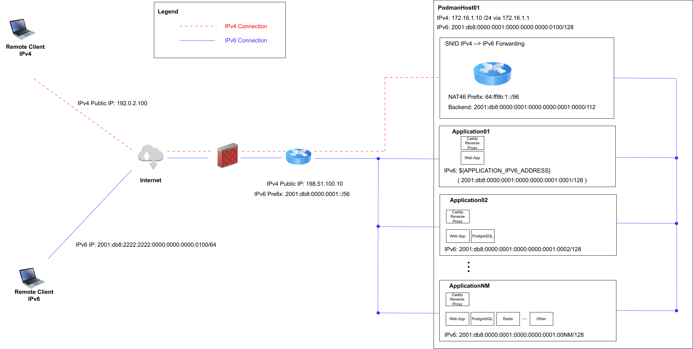

# Introduction
This setup assigns a single IPv6 Address to each Application running on the Podman Host, with `podman` running as Normal User (rootless).

An Application can be defined as a set of Containers that share the same Network Namespace.

An Application has all of its Containers located within the same `compose.yml` File.

Typically, for a Web Application, this includes the following:
- A Proxy Server (Caddy)
- An HTTP Application
- (optional) A Database Backend (e.g. PostgreSQL)
- (optional) A Caching Server (e.g. Redis)
- ...

For Remote Clients using IPv6 Connectivity, the Communication with the Container is Direct.

For Remote clients using IPv4 Connectivity, the [snid](https://github.com/AGWA/snid) TLS Proxy Server is Used to achieve an IPv4 <-> IPv6 Translation (NAT46). This required `root` Privileges.

This Tutorial will illustrate how all of this can be achieved using `pasta`, `snid`, `systemd` Services and `podman-compose`.

A similar Result can probably be achieved using Quadlets or Podlets instead of `systemd` and `podman-compose`.

# Pasta Networking
> **Warning**  
> 
> While `pasta` is the Default Networking for rootless `podman` since Podman 5.0, this is NOT the case for `podman-compose` ! Indeed `podman-compose` (at least until and including Version 1.1.0) will default to create a Bridge Network, if `network_mode` is NOT set to `pasta:[list_of_options_for_pasta]`

> **Warning**  
> 
> `traefik` does NOT appear to be working with anything besides rootlessport `bridge` !
> I tried to use `pasta` with `traefik` Container and I kept getting a `service \"dashboard\" error: unable to find the IP address for the container \"/traefik\": the server is ignored).`.

> **Note**  
>
> `podman` does indeed NOT appear to register any IPAddress when using `pasta` Networking, based on `podman inspect <container>`, which might explain why `traefik` is failing.

# Network Conventions within the Tutorial
A lof of Network Conventions are assumed within this Tutorial, with lots of IP Addresses to Remember.

This is Important because in the following Sections it will be explained the Operations to be performed in order to assign/set the required IP Addresses and Routes between Host and Container.

This Tutorial assumes the General "Homelab" Setup (within a LAN/VLAN), or Hosted but sitting behind another Firewall+Router such as OPNSense. In other words, the Podman Host is assumed to be NAT regarding IPv4.

This is NOT required in case you have a Server which has a Public IPv4 Address, however for the sake of Explanation, the NAT Setup is best, especially with regards to logging the Remote Client IPv4 Address.



The Podman Host (Bare Metal or e.g. KVM Virtual Machine) is supposed to have:
- Public IPv4 Address: `198.51.100.10` (https://www.rfc-editor.org/rfc/rfc5737)
- Private IPv4 Address: `172.16.1.10/24`
- Public+Private IPv6 Address: IPv6: `2001:db8:0000:0001:0000:0000:0000:0100/128` (https://www.rfc-editor.org/rfc/rfc3849.html)

Each Application will furthermore have an IPv6 Address, to which it will bind the Required Ports, which are typically:
- Port `443/tcp` (HTTPS)
- Port `443/udp` (HTTP3)
- Port `80/tcp` (HTTP)

The Applications are supposed to be located within the following Network (corresponding to `snid` Backend CIDR Configuration): `2001:db8:0000:0001:0000:0000:0001:0000/112` (`2001:db8:0000:0001:0000:0000:0001:0000` ... `2001:db8:0000:0001:0000:0000:0001:ffff`). Other IPv6 Addresses are also Possible, but then you must adjust `snid` Backend CIDR accordingly !

For simplicity, the Application (`application01.MYDOMAIN.TLD`) described in this Tutorial will have `APPLICATION_IPV6_ADDRESS="2001:db8:0000:0001:0000:0000:0001:0001"`.

One Remote End-Client (Laptop) is supposed to have IPv4 Address:
- Public IPv4 Address: `192.0.2.100` (https://www.rfc-editor.org/rfc/rfc5737)

Another Remote End-Client (Laptop) is supposed to have IPv6 Address:
- Public+Private IPv6 Address: `2001:db8:2222:2222:0000:0000:0000:0100/128` (https://www.rfc-editor.org/rfc/rfc3849.html)

The IP Addresses of the Routers/Firewalls themselves are not described in this Section, as they are not relevant for the Configuration described by this Tutorial.

> **Note**  
>
> Remember to Open the Required Ports in the Upstream Firewall (e.g. OPNSense, OpenWRT, etc) as well as on the Podman Host, if a Firewall is Enabled (e.g. `firewalld` , `ufw` , `iptables` , `nftables`, etc).

# snid Setup
In order to ensure that IPv4-only Remote Clients can access the Applications running on the Podman Host (Applications which ONLY have an IPv6 Address), an IPv4 <-> IPv6 Translation must be performed.

This Setup assumes that `snid` is installed on the Podman Host itself.

Other Setups where `snid` is running e.g. in a separate KVM Virtual Machine are possible, but require setting up a Static Route from the Podman Host to `64:ff9b:1::/96` (otherwise the Application can be contacted by the Remote Client, but the Application will NOT be able to send any Reply to it).

The easiest way to run `snid` is to download the precompiled Binary from the Official Website and setup a Systemd Service for it. Compiling `snid` from Source it's possible but it involves installing the `go` Development Toolchain, which is NOT the purpose of this Tutorial.

First Download the Program:
```
# Run these Commands on the Podman Host as <root>
mkdir -p /opt/snid
wget https://github.com/AGWA/snid/releases/download/v0.3.0/snid-v0.3.0-linux-amd64 -O /opt/snid/snid
chmod +x /opt/snid/snid
```

## Rootfull Service

This Probably requires (also as Root) in `/etc/sysctl.conf`:
```
net.ipv6.ip_nonlocal_bind=1
```

Then create a Systemd Service for it in `/etc/systemd/system/snid.service`
```
# To get SNID to work:
# Backend CIDR is supposed to be:
# - Backend CIDR: 2001:db8:0000:0001:0000:0000:0001:0001/112 (2001:db8:0000:0001:0000:0000:0001:0000 ... 2001:db8:0000:0001:0000:0000:0001:ffff)
#
# Convert IPv4 Address to IPv6 Address Representation: 
# - https://www.agwa.name/blog/post/using_sni_proxying_and_ipv6_to_share_port_443
# - https://www.rfc-editor.org/rfc/rfc6052
# - https://github.com/luckylinux/ipv6-decode-ipv4-address

[Unit]
Description=SNID Service

[Service]
# Running as rootless does NOT appear to work, even when adding AmbientCapabilities=CAP_NET_BIND_SERVICE
User=root
ExecStartPre=/bin/bash -c 'sleep 10'
ExecStart=/bin/bash -c 'cd /opt/snid && ip route replace local 64:ff9b:1::/96 dev lo && ./snid -listen tcp:172.16.1.10:443 -mode nat46 -nat46-prefix 64:ff9b:1:: -backend-cidr 2001:db8:0000:0001:0000:0000:0001:0001/112'
ExecStop=/bin/bash -c 'cd /opt/snid && ip route del local 64:ff9b:1::/96 dev lo'

[Install]
WantedBy=multi-user.target
```

Reload Systemd, enable and Start the Service:
```
systemctl daemon-reload
systemctl enable snid.service
systemctl restart snid.service
systemctl status snid.service
```

Check that no Errors occurred !

## Rootless Service
An enhancement of the original `/etc/systemd/system/snid.service` can be done, by splitting up the Service in two Parts:
- Routes Setup Service (requires Root Privileges): `/etc/systemd/system/snid-routes.service`
- Server Service (can be run as Normal User): `/etc/systemd/system/snid-server.service`

Since the Routes are Setup in less than a Second and, after that, `snid` is run as Normal User, the attack Surface is minimized. Even better would be to run the Service as a User which is DIFFERENT from the User Running `podman` (to ensure that the Files owned by `podman` CANNOT be accessed in case `snid` is compromized).

Of course this requires (but should be already in Place, since the Rootless Containers require it already) in `/etc/sysctl.conf`:
```
net.ipv4.ip_unprivileged_port_start=80
net.ipv4.ping_group_range=0 2000000
kernel.unprivileged_userns_clone=1

net.ipv6.ip_nonlocal_bind=1
```

Furthermore concerning the User Account Setup (it is preferable to use a different User compared to the one running the Podman Containers, for the Reasons outlined above):
```
groupadd snid
useradd --shell /usr/sbin/nologin -g snid --base-dir /opt/snid snid
chown snid:snid /opt/snid/snid
chmod 0770 /opt/snid/snid
```

`/etc/systemd/system/snid-routes.service`:
```
# To get SNID to work:
# - ip route add local the_nat46_prefix/96 dev lo
# - nmcli connection modify lo +ipv6.routes "64:ff9b:1::/96 dev lo" -> NOT WORKING
# - Backend CIDR: 2001:db8:0000:0001:0000:0000:0001:0001/112 (2001:db8:0000:0001:0000:0000:0001:0000 ... 2001:db8:0000:0001:0000:0000:0001:ffff)
#
# Convert IPv4 Address to IPv6 Address Representation: 
# - https://www.agwa.name/blog/post/using_sni_proxying_and_ipv6_to_share_port_443
# - https://www.rfc-editor.org/rfc/rfc6052

[Unit]
Description=SNID Routes Setup Service

[Service]
#Type=oneshot
User=root
ExecStart=/bin/bash -c 'ip route replace local 64:ff9b:1::/96 dev lo'
ExecStop=/bin/bash -c 'ip route del local 64:ff9b:1::/96 dev lo'
RemainAfterExit=yes

[Install]
WantedBy=multi-user.target
```

For the Service Part, we just put a Condition that requires `snid-routes.service` to be Run before (`Requires`).

`/etc/systemd/system/snid-server.service`:
```
# To get SNID to work:
# - ip route add local the_nat46_prefix/96 dev lo
# - nmcli connection modify lo +ipv6.routes "64:ff9b:1::/96 dev lo" -> NOT WORKING
# - Backend CIDR: 2001:db8:0000:0001:0000:0000:0001:0001/112 (2001:db8:0000:0001:0000:0000:0001:0000 ... 2001:db8:0000:0001:0000:0000:0001:ffff)
#
# Convert IPv4 Address to IPv6 Address Representation: 
# - https://www.agwa.name/blog/post/using_sni_proxying_and_ipv6_to_share_port_443
# - https://www.rfc-editor.org/rfc/rfc6052

[Unit]
Description=SNID Server Service
Requires=snid-routes.service

[Service]
User=snid
Group=snid
ExecStart=/bin/bash -c 'cd /opt/snid && ./snid -listen tcp:172.16.1.10:443 -mode nat46 -nat46-prefix 64:ff9b:1:: -backend-cidr 2001:db8:0000:0001:0000:0000:0001:0001/112'

# Not currently used
#ExecStop=/bin/bash -c 'cd /opt/snid'

[Install]
WantedBy=multi-user.target
```

Reload Systemd, enable and Start the Services:
```
# Reload Systemd Daemon
systemctl daemon-reload

# Enable Services
systemctl enable snid-routes.service
systemctl enable snid-server.service

# Check for potential Errors
systemctl restart snid-server.service
systemctl status snid-server.service
journalctl -xeu snid-server.service

# Check for potential Errors
systemctl status snid-routes.service
journalctl -xeu snid-routes.service
```

# IPv6 Networking Setup
> **Warning**  
> 
> Each Application has a different IPv6 Address MUST FIRST BE REGISTED ON THE HOST as well. It is NOT possible to just start the Container and expect it to bind to the IP Address configured in `compose.yml` if the IP Address was not registered on the Host in the first Place !

General:
```
ip -6 addr add 2001:db8:0000:0001:0000:0000:0001:0001/64 dev ens18 
```

For Fedora:
```
nmcli connection edit ens18
set ipv6.address
2001:db8:0000:0001:0000:0000:0001:0001
"Do you want to set 'ipv6.method' to manual"? -> no
nmcli connection show ens18 | grep -i addr
systemctl restart NetworkManager
```

For Debian/Ubuntu add in `/etc/network/interfaces` (or `/etc/network/interfaces.d/<my-interface>`) a line within the relevant Interface Block:
```
ip -6 addr add 2001:db8:0000:0001:0000:0000:0001:0001/64 dev ens18
```

# DNS Setup
In Order for Direct IPv6 Connectivity to work, an appropriate AAAA (IPv6) Record Must be present for the Application Hostname:
```
application01          IN      AAAA    2001:db8:0000:0001:0000:0000:0001:0001
```

For IPv4 Connectivity, it is the IPv4 Address of the `snid` Host that must be Entered.
In this Tutorial, since `snid` is assumed to be running on the Podman Host itself, this simply means creating an A Record for the Podman Host itself:
```
application01          IN      A    198.51.100.10
```

> **Warning**  
> 
> Issues can arise due to DNSSec and/or DNS over TLS Configuration related Issues. Try to disable those, flush caches with `resolvectl flush-caches` and issue `systemctl restart systemd-resolved` to see if the Issue disappears.

> **Note**  
> 
> I am NOT 100% sure that this is required. However, if you want to perform Host Overrides on DNS Level and still want to use DNSSec, you MUST have a Nameserver that is correctly registered with DNSSec in your Registrar Control Panel.

In case of DNS with Cloudflare DNS Proxy (or similar by another Provider) furthermore, `snid` probably will NOT work, since the IPv6 Addresses on Cloudflare DNS Servers will NOT match the CIDR Backend for `snid` at least. Furthermore, I am NOT sure how these in-out-in Connections Loops will be handled by both `snid` and the Firewall.

In order to mitigate against this, I ended up running an LXC Container in the DMZ Zone, i.e. in the same IPv4 (and IPv6) Subnet as the Podman Host, which acts as an Authoritative Name Server.

These are just some Notes. For a full-fledged BIND Configuration, please refer to the relevant Tutorials.

BIND Local DNS Server:
- Public IPv4: `198.51.100.10`
- Private IPv4: `172.16.1.3`
- Public+Private IPv6: `2001:db8:0000:0001:0000:0000:0000:0003/128`

As explained previously, detailed Setup Instructions are outside of the Purpose of this Tutorial. To enable DNSSec you can however follow this [Excellent Tutorial](https://www.talkdns.com/articles/a-beginners-guide-to-dnssec-with-bind-9/).

DNS Over TLS can be Enabled in `/etc/bind/named.conf` by adding a few Lines and Certificates (I manage them using `certbot`, your Mileage might vary):
```
// TLS Certificates and Key
tls letsencrypt-tls {
        cert-file "/etc/letsencrypt/fullchain.pem";
        key-file "/etc/letsencrypt/privkey.pem";
};

...

// Unencrypted
listen-on-v6 port 53 { ::1; };
listen-on port 53 { localhost; 127.0.0.1; 172.16.1.3; any; };

// DNS over TLS
listen-on-v6 port 853 tls letsencrypt-tls { ::1; };
listen-on port 853 tls letsencrypt-tls { localhost; 127.0.0.1; 172.16.1.3; any; };
```

Set BIND to be Authoritative Nameserver for the Domain, while forwarding everything else to Hosting Provider DNS Servers:
```
view "internal" {
        match-clients { 172.16.1.0/24; localhost; 127.0.0.1; };
        recursion yes;

        allow-recursion {
                /* Only trusted addresses are allowed to use recursion. */
                trusted;
        };

        zone "MYDOMAIN.TLD" IN {
                type master;
                file "/etc/bind/pri/MYDOMAIN.TLD.internal";
                notify yes;

                // Instruct BIND to sign the Zone File
                dnssec-policy default;                   # this enables BIND's fully automated key and signing policy
                                                         #  - (ISC's recommended way to manage DNSSEC)
                key-directory "/etc/bind/keys";          # this sets the directory in which this zone's DNSSEC keys will be stored
                inline-signing yes;                      # this allows BIND to transparently update our signed zone file
                                                         # whenever we change the unsigned file
        };


        zone "." {
                type forward;
                forward only;
                forwarders {
			                  // Use Google Public Recursive Name Servers
                        8.8.8.8;
			                  8.8.4.4;
			                  2001:4860:4860::8888;
			                  2001:4860:4860::8844;
                };
        };


        // Default Zones
        include "/etc/bind/named.conf.default-zones";
};
```

Then it's pretty much a standard BIND Zone Configuration File:
```
; MYDOMAIN.TLD.

$ORIGIN MYDOMAIN.TLD.
$TTL    5m
@       IN      SOA	ns1.MYDOMAIN.TLD. ns2.MYDOMAIN.TLD. (
	                      YYYYMMDD01					; Serial (10 digits)
                        604800							; Refresh
                        3600							  ; Retry
			                  ;86400							; Retry
                        2419200							; Expire
                        604800)							; Negative Cache TTL
;

; Authoritative nameservers
			                  IN      NS      ns1
			                  IN	    NS	    ns2

; Defaults 
                        IN      A       198.51.100.10

; Nameservers
ns1                     IN      A       198.51.100.10
ns1			                IN	    AAAA	  2001:db8:0000:0001:0000:0000:0000:0003

; For now NS2 is just the same as NS1
ns2                     IN      A       198.51.100.10
ns2			                IN	    AAAA	  2001:db8:0000:0001:0000:0000:0000:0003

; ##########################################################################################

podmanhost01		        IN	    A	      198.51.100.10
podmanhost01        	  IN	    AAAA	  2001:db8:0000:0001:0000:0000:0000:0100

whoami			            IN	    A       198.51.100.10
whoami			            IN      AAAA    2001:db8:0000:0001:0000:0000:0001:0001

```

Add to `/etc/systemd/resolved.conf` on the DNS Server Host:
```
[Resolve]
# Use local BIND Name Server, which will forward to Hetzner Recursive Name Servers for external (non-managed) Domains
DNS=127.0.0.1
Domains=MYDOMAIN.TLD
DNSSEC=yes
DNSOverTLS=opportunistic

# Set to NO since there is already a DNS Server on the System (BIND/NAMED)
DNSStubListener=no
```

Add to `/etc/systemd/resolved.conf` on the Podman Host:
```
[Resolve]
DNS=172.16.1.3 2001:db8:0000:0001:0000:0000:0000:0003
#FallbackDNS=
Domains=MYDOMAIN.TLD
DNSSEC=yes
DNSOverTLS=opportunistic
```

On both Hosts, run:
```
systemctl restart systemd-resolved
```

In this way, the correct IPv4 <-> IPv6 Translation should be performed and the correct Application should now be able to be reacheable.

# Compose File Setup
Two different Approaches for the Compose File are Possible and both Work.

## env File
In order to simplify the Setup, it is Proposed to store the IP Address in an `.env` File.

```
echo 'APPLICATION_IPV6_ADDRESS="2001:db8:0000:0001:0000:0000:0001:0001"' >> .env
```

In this way, the `compose.yml` can be evaluated with the `${APPLICATION_IPV6_ADDRESS}` Variable replaced by its Value, by running:
```
podman-compose config
```

## Compose with Port Mapping + Minimal Pasta Line
With this Method, `podman ps` will show the Open Ports in its Output.

```
services:
  whoami-caddy:
    image: caddy:latest
    #image: lucaslorentz/caddy-docker-proxy:2.9-alpine
    pull_policy: "missing"
    container_name: whoami-caddy
    restart: "unless-stopped"
    security_opt:
      - no-new-privileges:true
      - label=type:container_runtime_t
    ports:
      - target: 80
        host_ip: "[${APPLICATION_IPV6_ADDRESS}]"
        published: 80
        protocol: tcp
      - target: 443
        host_ip: "[${APPLICATION_IPV6_ADDRESS}]"
        published: 443
        protocol: tcp
      - target: 443
        host_ip: "[${APPLICATION_IPV6_ADDRESS}]"
        published: 443
        protocol: udp
    network_mode: "pasta:--ipv6-only"
    volumes:
 #     - /run/user/1001/podman/podman.sock:/var/run/docker.sock:rw,z
      - ./Caddyfile:/etc/caddy/Caddyfile:ro,z
      - ~/containers/data/whoami-caddy:/data:rw,z
      - ~/containers/log/whoami-caddy:/var/log:rw,z
      - ~/containers/config/whoami-caddy:/config:rw,z
      - ~/containers/certificates/letsencrypt:/certificates:ro,z
    environment:
      - CADDY_DOCKER_CADDYFILE_PATH=/etc/caddy/Caddyfile

  # Proxy to container
  whoami-application:
    image: traefik/whoami
    pull_policy: "missing"
    container_name: whoami-application
    restart: "unless-stopped"
    network_mode: "service:whoami-caddy"
    environment:
      - WHOAMI_PORT_NUMBER=8080
```

## Compose with only Pasta Line
With this Method, `podman ps` will NOT show the Open Ports in its Output.

In fact, `podman inspect <container>` will NOT list the IP Addresses nor where the Ports are bound to.

This works correctly, but the only way to examine if the Port is used is to run `ss -nlt6`.

```
services:
  whoami-caddy:
    image: caddy:latest
    #image: lucaslorentz/caddy-docker-proxy:2.9-alpine
    pull_policy: "missing"
    container_name: whoami-caddy
    restart: "unless-stopped"
    security_opt:
      - no-new-privileges:true
      - label=type:container_runtime_t
    network_mode: "pasta:--ipv6-only,-t,${APPLICATION_IPV6_ADDRESS}/80,-t,${APPLICATION_IPV6_ADDRESS}/443,-u,${APPLICATION_IPV6_ADDRESS}/443"
    volumes:
 #     - /run/user/1001/podman/podman.sock:/var/run/docker.sock:rw,z
      - ./Caddyfile:/etc/caddy/Caddyfile:ro,z
      - ~/containers/data/whoami-caddy:/data:rw,z
      - ~/containers/log/whoami-caddy:/var/log:rw,z
      - ~/containers/config/whoami-caddy:/config:rw,z
      - ~/containers/certificates/letsencrypt:/certificates:ro,z
    environment:
      - CADDY_DOCKER_CADDYFILE_PATH=/etc/caddy/Caddyfile

  # Proxy to container
  whoami-application:
    image: traefik/whoami
    pull_policy: "missing"
    container_name: whoami-application
    restart: "unless-stopped"
    network_mode: "service:whoami-caddy"
    environment:
      - WHOAMI_PORT_NUMBER=8080
```

> **Warning**  
> 
> Netstat is deprecated. `netstat -an | grep -i listen` will NOT return the correct IPv6 Addresses in most cases, because it truncates the Output. `netstat -Wan | grep -i listen` will return the full IPv6 Address wthout truncating it, but you should really be using `ss -nlt6` instead.

# Caddy Proxy Configuration
For Simple Configurations of Applications and automatically generating a SSL Certificate using Letsencrypt with the HTTP(S) Challenge, one can just define `command` within the `compose.yml` File to something like:
```
command: reverse-proxy --from application01.MYDOMAIN.TLD --to 'http//[::1]:8080'
```

For semi-automated Setups, one can use the `lucaslorentz/caddy-docker-proxy` Docker Image, which allows to set Caddy Options directly within the `compose.yml` File.

I am NOT used to this Syntax, so I am just using the Caddyfile, at least for now.
This is also due to the Fact that I am self-managing the Letsencrypt Certificates using `certbot` and distributing them across my Infrastructure.

Your mileage may vary :).

```
# Example and Guide
# https://caddyserver.com/docs/caddyfile/options

# General Options
{
    # Debug Mode
    debug

    # Ports Configuration
    #http_port 80
    #https_port 443

    # TLS Options
    auto_https disable_certs

    # Default SNI
    default_sni MYDOMAIN.TLD
}


localhost {
	reverse_proxy /api/* localhost:9001
}

application01.MYDOMAIN.TLD {
        tls /certificates/MYDOMAIN.TLD/fullchain.pem /certificates/MYDOMAIN.TLD/privkey.pem
        log {
		output file /var/log/application01.MYDOMAIN.TLD/access.json {
			roll_size 100MiB
			roll_keep 5000
			roll_keep_for 720h
            roll_uncompressed
		}
        format json
	}

    reverse_proxy http://[::1]:8080
}
```

# Redirects
## General
When handling Redirects, HTTP Codes `301` (`Moved Permanently`), `302` (`Found (Temporary Redirect)`), `307` (`Temporary Redirect`) and `308` (`Permanent Redirect`) are Typically Used.

References:
- https://storychief.io/blog/301-302-307-308-redirect
- https://www.infidigit.com/blog/308-permanent-redirect/

When a 308 redirect code is specified, the client must repeat the exact same request (POST or GET) on the target location. For 301 redirect, the client may not necessarily follow the exact same request. 

Since the HTTPS must always be Enforced (`Permanent Redirect`) and the Client should perform the exact same Request over HTTPS that was performed over HTTP, the Code `308` seems more Appropriate.

## HTTP -> HTTPS for IPv4 Redirects
The `snid` Service does NOT handle HTTP (non-HTTPS) Requests and does NOT bind to the IPv4 Address on Port 80.

This Problem (IPv4 HTTP -> HTTPS Redirects) can easily be solved by using a one-off (for the entire Podman Host) Caddy Container.

(Option 1) `compose.yml` with "Normal" Ports Mappings:
```
services:
  redirect-http-ipv4-caddy:
    image: caddy:latest
    pull_policy: "missing"
    container_name: redirect-http-ipv4-caddy
    restart: "unless-stopped"
    security_opt:
      - no-new-privileges:true
      - label=type:container_runtime_t
    ports:
      - target: 80
        host_ip: 172.16.1.12
        published: 80
        protocol: tcp
    network_mode: "pasta:--ipv4-only"
    volumes:
      - ./Caddyfile:/etc/caddy/Caddyfile:ro,z
      - ~/containers/data/redirect-http-ipv4-caddy:/data:rw,z
      - ~/containers/log/redirect-http-ipv4-caddy:/var/log:rw,z
      - ~/containers/config/redirect-http-ipv4-caddy:/config:rw,z
      - ~/containers/certificates/letsencrypt:/certificates:ro,z
    environment:
      - CADDY_DOCKER_CADDYFILE_PATH=/etc/caddy/Caddyfile

```

(Option 2) `compose.yml` with "Pasta" One-Liner:
```
services:
  redirect-http-ipv4-caddy:
    image: caddy:latest
    pull_policy: "missing"
    container_name: redirect-http-ipv4-caddy
    restart: "unless-stopped"
    security_opt:
      - no-new-privileges:true
      - label=type:container_runtime_t
    network_mode: "pasta:--ipv4-only,-t,172.16.1.12/80"
    volumes:
      - ./Caddyfile:/etc/caddy/Caddyfile:ro,z
      - ~/containers/data/redirect-http-ipv4-caddy:/data:rw,z
      - ~/containers/log/redirect-http-ipv4-caddy:/var/log:rw,z
      - ~/containers/config/redirect-http-ipv4-caddy:/config:rw,z
      - ~/containers/certificates/letsencrypt:/certificates:ro,z
    environment:
      - CADDY_DOCKER_CADDYFILE_PATH=/etc/caddy/Caddyfile
```


`Caddyfile`:
```
# Example and Guide
# https://caddyserver.com/docs/caddyfile/options

# General Options
{
    # Debug Mode
    debug
}

# Redirect TCP IPV4 HTTP Requests to HTTPS
http:// {
  bind tcp4/172.16.1.12
  redir https://{host}{uri} 308

# Logging
  log {
	output file /var/log/access.json {
		roll_size 100MiB
		roll_keep 5000
		roll_keep_for 720h
		roll_uncompressed
	}
        format json
  }
}
```

## HTTP -> HTTPs for IPv6 Redirects
"Native" IPv6 Redirects are Handled by Caddy Proxy listening on the Configured IPv6 Address.

This is already described in the Application `compose.yml` File described Previously.

The Redirect itself is setup by Caddy automatically by Default (see https://caddyserver.com/docs/automatic-https).

# Run the Application
Simply Run
```
podman-compose up -d
```

In case of Issues, you might want to Debug with DEBUG log level and disabling detached mode:
```
podman-compose --podman-run-args="--log-level=debug" up
```

# Testing
From a Remote Client (NOT located withing the same LAN, try to use 4G/LTE Connectivity otherwise) test that Connectivity is working.

It is reccomended to test against something like `traefik/whoami` Application (as described in this Tutorial's `compose.yml` File), which can display many Parameters, including HTTP and especially X-Forwarded-For Headers.

In order to follow the Redirects, `curl` MUST be invoked with the `-L` Argument.

Thee `-vvv` Argument is only to Obtain more Verbose Output (which can be Useful for Debugging) and can be omitted if everything is working normally.

## IPv6 Testing
IPv6 HTTPS Test (do NOT follow redirects) should yield a `200` Status Response (`OK`):
```
curl -vvv -6 https://application01.MYDOMAIN.TLD
```

IPv6 HTTP Test (do NOT follow redirects) should yield a `308` Status Response (`Permanent Redirect`):
```
curl -vvv -6 http://application01.MYDOMAIN.TLD
```

IPv6 HTTP Test (follow redirects) should yield a `200` Status Response (`OK`):
```
curl -vvv -6 -L http://application01.MYDOMAIN.TLD
```

## IPv4 Testing
IPv4 HTTPS Test (do NOT follow redirects) should yield a `200` Status Response (`OK`):
```
curl -vvv -4 https://application01.MYDOMAIN.TLD
```

IPv4 HTTP Test (do NOT follow redirects) should yield a `308` Status Response (`Permanent Redirect`):
```
curl -vvv -4 https://application01.MYDOMAIN.TLD
```

IPv4 HTTP Test (follow redirects) should yield a `200` Status Response (`OK`):
```
curl -vvv -4 -L http://application01.MYDOMAIN.TLD
```

In case of Issues in the IPv4 Test, check the `snid` Service Status for Clues:
```
systemctl status snid.service
journalctl -xeu snid.service
```

You might also want to check the `caddy` Proxy Logs for other Clues:
```
podman logs caddy
cat ~/containers/log/caddy/application01.MYDOMAIN.TLD/access.json | jq -r
```

# Translating IPv6 to IPv4 based on Logs
This [Tool](https://github.com/luckylinux/ipv6-decode-ipv4-address) can be used to Translate IPv4-Embedded Addresses (within an IPv6 Address, done by `snid` through `NAT46`) back to the Original IPv4 Address.

Simply read the Logs and look for `request`, especially `client_ip` and `remote_ip`.

#  References
Other Useful References:
- https://docs.freifunk-franken.de/technik-und-konzepte/sni-proxy/
- https://git.freifunk-franken.de/freifunk-franken/docs/raw/branch/master/content/technik-und-konzepte/sni-proxy.md
- https://www.agwa.name/blog/post/using_sni_proxying_and_ipv6_to_share_port_443