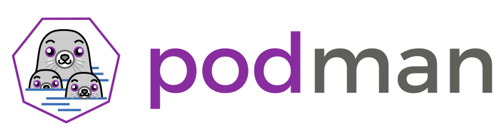

# Troubleshooting

## A list of common issues and solutions for Podman

---
### 1) Variety of issues - Validate Version

A large number of issues reported against Podman are often found to already be fixed
in more current versions of the project.  Before reporting an issue, please verify the
version you are running with `podman version` and compare it to the latest release
documented on the top of Podman's [README.md](README.md).

If they differ, please update your version of PODMAN to the latest possible
and retry your command before reporting the issue.

---
### 2) Can't use volume mount, get permission denied

$ podman run -v ~/mycontent:/content fedora touch /content/file
touch: cannot touch '/content/file': Permission denied

#### Solution

This is sometimes caused by SELinux, and sometimes by user namespaces.

Labeling systems like SELinux require that proper labels are placed on volume
content mounted into a container. Without a label, the security system might
prevent the processes running inside the container from using the content. By
default, Podman does not change the labels set by the OS.

To change a label in the container context, you can add either of two suffixes
**:z** or **:Z** to the volume mount. These suffixes tell Podman to relabel file
objects on the shared volumes. The **z** option tells Podman that two containers
share the volume content. As a result, Podman labels the content with a shared
content label. Shared volume labels allow all containers to read/write content.
The **Z** option tells Podman to label the content with a private unshared label.
Only the current container can use a private volume.

$ podman run -v ~/mycontent:/content:Z fedora touch /content/file

Make sure the content is private for the container.  Do not relabel system directories and content.
Relabeling system content might cause other confined services on your machine to fail.  For these
types of containers we recommend that disable SELinux separation.  The option `--security-opt label=disable`
will disable SELinux separation for the container.

$ podman run --security-opt label=disable -v ~:/home/user fedora touch /home/user/file

In cases where the container image runs as a specific, non-root user, though, the
solution is to fix the user namespace.  This would include container images such as
the Jupyter Notebook image (which runs as "jovyan") and the Postgres image (which runs
as "postgres").  In either case, use the `--userns` switch to map user namespaces,
most of the time by using the **keep-id** option.

$ podman run -v "$PWD":/home/jovyan/work --userns=keep-id jupyter/scipy-notebook

---
### 3) No such image or Bare keys cannot contain ':'

When doing a `podman pull` or `podman build` command and a "common" image cannot be pulled,
it is likely that the `/etc/containers/registries.conf` file is either not installed or possibly
misconfigured.

#### Symptom

```console
$ sudo podman build -f Dockerfile
STEP 1: FROM alpine
error building: error creating build container: no such image "alpine" in registry: image not known
```

or

```console
$ sudo podman pull fedora
error pulling image "fedora": unable to pull fedora: error getting default registries to try: Near line 9 (last key parsed ''): Bare keys cannot contain ':'.
```

#### Solution

  * Verify that the `/etc/containers/registries.conf` file exists.  If not, verify that the containers-common package is installed.
  * Verify that the entries in the `unqualified-search-registries` list of the `/etc/containers/registries.conf` file are valid and reachable.
    * i.e. `unqualified-search-registries = ["registry.fedoraproject.org", "quay.io", "registry.access.redhat.com"]`

---
### 4) http: server gave HTTP response to HTTPS client

When doing a Podman command such as `build`, `commit`, `pull`, or `push` to a registry,
tls verification is turned on by default.  If authentication is not used with
those commands, this error can occur.

#### Symptom

```console
$ sudo podman push alpine docker://localhost:5000/myalpine:latest
Getting image source signatures
Get https://localhost:5000/v2/: http: server gave HTTP response to HTTPS client
```

#### Solution

By default tls verification is turned on when communicating to registries from
Podman.  If the registry does not require authentication the Podman commands
such as `build`, `commit`, `pull` and `push` will fail unless tls verification is turned
off using the `--tls-verify` option.  **NOTE:** It is not at all recommended to
communicate with a registry and not use tls verification.

  * Turn off tls verification by passing false to the tls-verification option.
  * I.e. `podman push --tls-verify=false alpine docker://localhost:5000/myalpine:latest`

---
### 5) rootless containers cannot ping hosts

When using the ping command from a non-root container, the command may
fail because of a lack of privileges.

#### Symptom

```console
$ podman run --rm fedora ping -W10 -c1 redhat.com
PING redhat.com (209.132.183.105): 56 data bytes

--- redhat.com ping statistics ---
1 packets transmitted, 0 packets received, 100% packet loss
```

#### Solution

It is most likely necessary to enable unprivileged pings on the host.
Be sure the UID of the user is part of the range in the
`/proc/sys/net/ipv4/ping_group_range` file.

To change its value you can use something like: `sysctl -w
"net.ipv4.ping_group_range=0 2000000"`.

To make the change persistent, you'll need to add a file in
`/etc/sysctl.d` that contains `net.ipv4.ping_group_range=0 $MAX_UID`.

---
### 6) Build hangs when the Dockerfile contains the useradd command

When the Dockerfile contains a command like `RUN useradd -u 99999000 -g users newuser` the build can hang.

#### Symptom

If you are using a useradd command within a Dockerfile with a large UID/GID, it will create a large sparse file `/var/log/lastlog`.  This can cause the build to hang forever.  Go language does not support sparse files correctly, which can lead to some huge files being created in your container image.

#### Solution

If the entry in the Dockerfile looked like: RUN useradd -u 99999000 -g users newuser then add the `--no-log-init` parameter to change it to: `RUN useradd --no-log-init -u 99999000 -g users newuser`. This option tells useradd to stop creating the lastlog file.

### 7) Permission denied when running Podman commands

When rootless Podman attempts to execute a container on a non exec home directory a permission error will be raised.

#### Symptom

If you are running Podman or Buildah on a home directory that is mounted noexec,
then they will fail. With a message like:

```
podman run centos:7
standard_init_linux.go:203: exec user process caused "permission denied"
```

#### Solution

Since the administrator of the system setup your home directory to be noexec, you will not be allowed to execute containers from storage in your home directory. It is possible to work around this by manually specifying a container storage path that is not on a noexec mount. Simply copy the file /etc/containers/storage.conf to ~/.config/containers/ (creating the directory if necessary). Specify a graphroot directory which is not on a noexec mount point and to which you have read/write privileges.  You will need to modify other fields to writable directories as well.

For example

```
cat ~/.config/containers/storage.conf
[storage]
  driver = "overlay"
  runroot = "/run/user/1000"
  graphroot = "/execdir/myuser/storage"
  [storage.options]
    mount_program = "/bin/fuse-overlayfs"
```

### 8) Permission denied when running systemd within a Podman container

When running systemd as PID 1 inside of a container on an SELinux
separated machine, it needs to write to the cgroup file system.

#### Symptom

Systemd gets permission denied when attempting to write to the cgroup file
system, and AVC messages start to show up in the audit.log file or journal on
the system.

#### Solution

Newer versions of Podman (2.0 or greater) support running init based containers
with a different SELinux labels, which allow the container process access to the
cgroup file system. This feature requires container-selinux-2.132 or newer
versions.

Prior to Podman 2.0, the SELinux boolean `container_manage_cgroup` allows
container processes to write to the cgroup file system. Turn on this boolean,
on SELinux separated systems, to allow systemd to run properly in the container.
Only do this on systems running older versions of Podman.

`setsebool -P container_manage_cgroup true`

### 9) Newuidmap missing when running rootless Podman commands

Rootless Podman requires the newuidmap and newgidmap programs to be installed.

#### Symptom

If you are running Podman or Buildah as a rootless user, you get an error complaining about
a missing newuidmap executable.

```
podman run -ti fedora sh
command required for rootless mode with multiple IDs: exec: "newuidmap": executable file not found in $PATH
```

#### Solution

Install a version of shadow-utils that includes these executables.  Note that for RHEL and CentOS 7, at least the 7.7 release must be installed for support to be available.

### 10) rootless setup user: invalid argument

Rootless Podman requires the user running it to have a range of UIDs listed in /etc/subuid and /etc/subgid.

#### Symptom

An user, either via --user or through the default configured for the image, is not mapped inside the namespace.

```
podman run --rm -ti --user 1000000 alpine echo hi
Error: container create failed: container_linux.go:344: starting container process caused "setup user: invalid argument"
```

#### Solution

Update the /etc/subuid and /etc/subgid with fields for users that look like:

```
cat /etc/subuid
johndoe:100000:65536
test:165536:65536
```

The format of this file is USERNAME:UID:RANGE

* username as listed in /etc/passwd or getpwent.
* The initial uid allocated for the user.
* The size of the range of UIDs allocated for the user.

This means johndoe is allocated UIDS 100000-165535 as well as his standard UID in the
/etc/passwd file.

You should ensure that each user has a unique range of uids, because overlapping UIDs,
would potentially allow one user to attack another user. In addition, make sure
that the range of uids you allocate can cover all uids that the container
requires. For example, if the container has a user with uid 10000, ensure you
have at least 10001 subuids.

You could also use the usermod program to assign UIDs to a user.

If you update either the /etc/subuid or /etc/subgid file, you need to
stop all running containers and kill the pause process.  This is done
automatically by the `system migrate` command, which can also be used
to stop all the containers and kill the pause process.

```
usermod --add-subuids 200000-201000 --add-subgids 200000-201000 johndoe
grep johndoe /etc/subuid /etc/subgid
/etc/subuid:johndoe:200000:1001
/etc/subgid:johndoe:200000:1001
```

### 11) Changing the location of the Graphroot leads to permission denied

When I change the graphroot storage location in storage.conf, the next time I
run Podman I get an error like:

```
# podman run -p 5000:5000 -it centos bash

bash: error while loading shared libraries: /lib64/libc.so.6: cannot apply additional memory protection after relocation: Permission denied
```

For example, the admin sets up a spare disk to be mounted at `/src/containers`,
and points storage.conf at this directory.


#### Symptom

SELinux blocks containers from using random locations for overlay storage.
These directories need to be labeled with the same labels as if the content was
under /var/lib/containers/storage.

#### Solution

Tell SELinux about the new containers storage by setting up an equivalence record.
This tells SELinux to label content under the new path, as if it was stored
under `/var/lib/containers/storage`.

```
semanage fcontext -a -e /var/lib/containers /srv/containers
restorecon -R -v /srv/containers
```

The semanage command above tells SELinux to setup the default labeling of
`/srv/containers` to match `/var/lib/containers`.  The `restorecon` command
tells SELinux to apply the labels to the actual content.

Now all new content created in these directories will automatically be created
with the correct label.

### 12) Anonymous image pull fails with 'invalid username/password'

Pulling an anonymous image that doesn't require authentication can result in an
`invalid username/password` error.

#### Symptom

If you pull an anonymous image, one that should not require credentials, you can receive
and `invalid username/password` error if you have credentials established in the
authentication file for the target container registry that are no longer valid.

```
podman run -it --rm docker://docker.io/library/alpine:latest ls
Trying to pull docker://docker.io/library/alpine:latest...ERRO[0000] Error pulling image ref //alpine:latest: Error determining manifest MIME type for docker://alpine:latest: unable to retrieve auth token: invalid username/password
Failed
Error: unable to pull docker://docker.io/library/alpine:latest: unable to pull image: Error determining manifest MIME type for docker://alpine:latest: unable to retrieve auth token: invalid username/password
```

This can happen if the authentication file is modified 'by hand' or if the credentials
are established locally and then the password is updated later in the container registry.

#### Solution

Depending upon which container tool was used to establish the credentials, use `podman logout`
or `docker logout` to remove the credentials from the authentication file.

### 13) Running Podman inside a container causes container crashes and inconsistent states

Running Podman in a container and forwarding some, but not all, of the required host directories can cause inconsistent container behavior.

#### Symptom

After creating a container with Podman's storage directories mounted in from the host and running Podman inside a container, all containers show their state as "configured" or "created", even if they were running or stopped.

#### Solution

When running Podman inside a container, it is recommended to mount at a minimum `/var/lib/containers/storage/` as a volume.
Typically, you will not mount in the host version of the directory, but if you wish to share containers with the host, you can do so.
If you do mount in the host's `/var/lib/containers/storage`, however, you must also mount in the host's `/run/libpod` and `/run/containers/storage` directories.
Not doing this will cause Podman in the container to detect that temporary files have been cleared, leading it to assume a system restart has taken place.
This can cause Podman to reset container states and lose track of running containers.

For running containers on the host from inside a container, we also recommend the [Podman remote client](docs/tutorials/remote_client.md), which only requires a single socket to be mounted into the container.

### 14) Rootless 'podman build' fails EPERM on NFS:

NFS enforces file creation on different UIDs on the server side and does not understand user namespace, which rootless Podman requires.
When a container root process like YUM attempts to create a file owned by a different UID, NFS Server denies the creation.
NFS is also a problem for the file locks when the storage is on it.  Other distributed file systems (for example: Lustre, Spectrum Scale, the General Parallel File System (GPFS)) are also not supported when running in rootless mode as these file systems do not understand user namespace.

#### Symptom
```console
$ podman build .
ERRO[0014] Error while applying layer: ApplyLayer exit status 1 stdout:  stderr: open /root/.bash_logout: permission denied
error creating build container: Error committing the finished image: error adding layer with blob "sha256:a02a4930cb5d36f3290eb84f4bfa30668ef2e9fe3a1fb73ec015fc58b9958b17": ApplyLayer exit status 1 stdout:  stderr: open /root/.bash_logout: permission denied
```

#### Solution
Choose one of the following:
  * Setup containers/storage in a different directory, not on an NFS share.
    * Create a directory on a local file system.
    * Edit `~/.config/containers/containers.conf` and point the `volume_path` option to that local directory. (Copy /usr/share/containers/containers.conf if ~/.config/containers/containers.conf does not exist)
  * Otherwise just run Podman as root, via `sudo podman`

### 15) Rootless 'podman build' fails when using OverlayFS:

The Overlay file system (OverlayFS) requires the ability to call the `mknod` command when creating whiteout files
when extracting an image.  However, a rootless user does not have the privileges to use `mknod` in this capacity.

#### Symptom
```console
podman build --storage-driver overlay .
STEP 1: FROM docker.io/ubuntu:xenial
Getting image source signatures
Copying blob edf72af6d627 done
Copying blob 3e4f86211d23 done
Copying blob 8d3eac894db4 done
Copying blob f7277927d38a done
Copying config 5e13f8dd4c done
Writing manifest to image destination
Storing signatures
Error: error creating build container: Error committing the finished image: error adding layer with blob "sha256:8d3eac894db4dc4154377ad28643dfe6625ff0e54bcfa63e0d04921f1a8ef7f8": Error processing tar file(exit status 1): operation not permitted
$ podman build .
ERRO[0014] Error while applying layer: ApplyLayer exit status 1 stdout:  stderr: open /root/.bash_logout: permission denied
error creating build container: Error committing the finished image: error adding layer with blob "sha256:a02a4930cb5d36f3290eb84f4bfa30668ef2e9fe3a1fb73ec015fc58b9958b17": ApplyLayer exit status 1 stdout:  stderr: open /root/.bash_logout: permission denied
```

#### Solution
Choose one of the following:
  * Complete the build operation as a privileged user.
  * Install and configure fuse-overlayfs.
    * Install the fuse-overlayfs package for your Linux Distribution.
    * Add `mount_program = "/usr/bin/fuse-overlayfs"` under `[storage.options]` in your `~/.config/containers/storage.conf` file.

### 16) RHEL 7 and CentOS 7 based `init` images don't work with cgroup v2

The systemd version shipped in RHEL 7 and CentOS 7 doesn't have support for cgroup v2.  Support for cgroup V2 requires version 230 of systemd or newer, which
was never shipped or supported on RHEL 7 or CentOS 7.

#### Symptom
```console

sh# podman run --name test -d registry.access.redhat.com/rhel7-init:latest && sleep 10 && podman exec test systemctl status
c8567461948439bce72fad3076a91ececfb7b14d469bfa5fbc32c6403185beff
Failed to get D-Bus connection: Operation not permitted
Error: non zero exit code: 1: OCI runtime error
```

#### Solution
You'll need to either:

* configure the host to use cgroup v1

```
On Fedora you can do:
# dnf install -y grubby
# grubby --update-kernel=ALL --args=”systemd.unified_cgroup_hierarchy=0"
# reboot
```

* update the image to use an updated version of systemd.

### 17) rootless containers exit once the user session exits

You need to set lingering mode through loginctl to prevent user processes to be killed once
the user session completed.

#### Symptom

Once the user logs out all the containers exit.

#### Solution
You'll need to either:

* loginctl enable-linger $UID

or as root if your user has not enough privileges.

* sudo loginctl enable-linger $UID

### 18) `podman run` fails with "bpf create: permission denied error"

The Kernel Lockdown patches deny eBPF programs when Secure Boot is enabled in the BIOS. [Matthew Garrett's post](https://mjg59.dreamwidth.org/50577.html) describes the relationship between Lockdown and Secure Boot and [Jan-Philip Gehrcke's](https://gehrcke.de/2019/09/running-an-ebpf-program-may-require-lifting-the-kernel-lockdown/) connects this with eBPF. [RH bug 1768125](https://bugzilla.redhat.com/show_bug.cgi?id=1768125) contains some additional details.

#### Symptom

Attempts to run podman result in

```Error: bpf create : Operation not permitted: OCI runtime permission denied error```

#### Solution

One workaround is to disable Secure Boot in your BIOS.

### 19) error creating libpod runtime: there might not be enough IDs available in the namespace

Unable to pull images

#### Symptom

```console
$ podman unshare cat /proc/self/uid_map
	 0       1000          1
```

#### Solution

```console
$ podman system migrate
```

Original command now returns

```
$ podman unshare cat /proc/self/uid_map
	 0       1000          1
	 1     100000      65536
```

Reference [subuid](https://man7.org/linux/man-pages/man5/subuid.5.html) and [subgid](https://man7.org/linux/man-pages/man5/subgid.5.html) man pages for more detail.

### 20) Passed-in devices or files can't be accessed in rootless container

As a non-root user you have group access rights to a device or files that you
want to pass into a rootless container with `--device=...` or `--volume=...`

#### Symptom

Any access inside the container is rejected with "Permission denied".

#### Solution

The runtime uses `setgroups(2)` hence the process looses all additional groups
the non-root user has. Use the `--group-add keep-groups` flag to pass the
user's supplementary group access into the container. Currently only available
with the `crun` OCI runtime.

### 21) A rootless container running in detached mode is closed at logout

When running a container with a command like `podman run --detach httpd` as
a rootless user, the container is closed upon logout and is not kept running.

#### Symptom

When logging out of a rootless user session, all containers that were started
in detached mode are stopped and are not kept running.  As the root user, these
same containers would survive the logout and continue running.

#### Solution

When systemd notes that a session that started a Podman container has exited,
it will also stop any containers that has been associated with it.  To avoid
this, use the following command before logging out: `loginctl enable-linger`.
To later revert the linger functionality, use `loginctl disable-linger`.

LOGINCTL(1), SYSTEMD(1)

### 22) Containers default detach keys conflict with shell history navigation

Podman defaults to `ctrl-p,ctrl-q` to detach from a running containers. The
bash and zsh shells default to ctrl-p for the displaying of the previous
command.  This causes issues when running a shell inside of a container.

#### Symptom

With the default detach key combo ctrl-p,ctrl-q, shell history navigation
(tested in bash and zsh) using ctrl-p to access the previous command will not
display this previous command. Or anything else.  Conmon is waiting for an
additional character to see if the user wants to detach from the container.
Adding additional characters to the command will cause it to be displayed along
with the additional character. If the user types ctrl-p a second time the shell
display the 2nd to last command.

#### Solution

The solution to this is to change the default detach_keys. For example in order
to change the defaults to `ctrl-q,ctrl-q` use the `--detach-keys` option.

```
podman run -ti --detach-keys ctrl-q,ctrl-q fedora sh
```

To make this change the default for all containers, users can modify the
containers.conf file. This can be done simply in your home directory, but adding the
following lines to users containers.conf

```
$ cat >> ~/.config/containers/containers.conf < _eof
[engine]
detach_keys="ctrl-q,ctrl-q"
_eof
```

In order to effect root running containers and all users, modify the system
wide defaults in /etc/containers/containers.conf


### 23) Container with exposed ports won't run in a pod

A container with ports that have been published with the `--publish` or `-p` option
can not be run within a pod.

#### Symptom

```
$ podman pod create --name srcview -p 127.0.0.1:3434:3434 -p 127.0.0.1:7080:7080 -p 127.0.0.1:3370:3370                        4b2f4611fa2cbd60b3899b936368c2b3f4f0f68bc8e6593416e0ab8ecb0a3f1d

$ podman run --pod srcview --name src-expose -p 3434:3434 -v "${PWD}:/var/opt/localrepo":Z,ro sourcegraph/src-expose:latest serve /var/opt/localrepo
Error: cannot set port bindings on an existing container network namespace
```

#### Solution

This is a known limitation.  If a container will be run within a pod, it is not necessary
to publish the port for the containers in the pod. The port must only be published by the
pod itself.  Pod network stacks act like the network stack on the host - you have a
variety of containers in the pod, and programs in the container, all sharing a single
interface and IP address, and associated ports. If one container binds to a port, no other
container can use that port within the pod while it is in use. Containers in the pod can
also communicate over localhost by having one container bind to localhost in the pod, and
another connect to that port.

In the example from the symptom section, dropping the `-p 3434:3434` would allow the
`podman run` command to complete, and the container as part of the pod would still have
access to that port.  For example:

```
$ podman run --pod srcview --name src-expose -v "${PWD}:/var/opt/localrepo":Z,ro sourcegraph/src-expose:latest serve /var/opt/localrepo
```

### 24) Podman container images fail with `fuse: device not found` when run

Some container images require that the fuse kernel module is loaded in the kernel
before they will run with the fuse filesystem in play.

#### Symptom

When trying to run the container images found at quay.io/podman, quay.io/containers
registry.access.redhat.com/ubi8 or other locations, an error will sometimes be returned:

```
ERRO error unmounting /var/lib/containers/storage/overlay/30c058cdadc888177361dd14a7ed7edab441c58525b341df321f07bc11440e68/merged: invalid argument
error mounting container "1ae176ca72b3da7c70af31db7434bcf6f94b07dbc0328bc7e4e8fc9579d0dc2e": error mounting build container "1ae176ca72b3da7c70af31db7434bcf6f94b07dbc0328bc7e4e8fc9579d0dc2e": error creating overlay mount to /var/lib/containers/storage/overlay/30c058cdadc888177361dd14a7ed7edab441c58525b341df321f07bc11440e68/merged: using mount program /usr/bin/fuse-overlayfs: fuse: device not found, try 'modprobe fuse' first
fuse-overlayfs: cannot mount: No such device
: exit status 1
ERRO exit status 1
```

#### Solution

If you encounter a `fuse: device not found` error when running the container image, it is likely that
the fuse kernel module has not been loaded on your host system.  Use the command `modprobe fuse` to load the
module and then run the container image afterwards.  To enable this automatically at boot time, you can add a configuration
file to `/etc/modules.load.d`.  See `man modules-load.d` for more details.

### 25) podman run --rootfs link/to//read/only/dir does not work

An error such as "OCI runtime error" on a read-only filesystem or the error "{image} is not an absolute path or is a symlink" are often times indicators for this issue.  For more details, review this [issue](
https://github.com/containers/podman/issues/5895).

#### Symptom

Rootless Podman requires certain files to exist in a file system in order to run.
Podman will create /etc/resolv.conf, /etc/hosts and other file descriptors on the rootfs in order
to mount volumes on them.

#### Solution

Run the container once in read/write mode, Podman will generate all of the FDs on the rootfs, and
from that point forward you can run with a read-only rootfs.

$ podman run --rm --rootfs /path/to/rootfs true

The command above will create all the missing directories needed to run the container.

After that, it can be used in read only mode, by multiple containers at the same time:

$ podman run --read-only --rootfs /path/to/rootfs ....

Another option would be to create an overlay file system on the directory as a lower and then
then allow podman to create the files on the upper.

### 26) Running containers with CPU limits fails with a permissions error

On some systemd-based systems, non-root users do not have CPU limit delegation
permissions. This causes setting CPU limits to fail.

#### Symptom

Running a container with a CPU limit options such as `--cpus`, `--cpu-period`,
or `--cpu-quota` will fail with an error similar to the following:

    Error: opening file `cpu.max` for writing: Permission denied: OCI runtime permission denied error

This means that CPU limit delegation is not enabled for the current user.

#### Solution

You can verify whether CPU limit delegation is enabled by running the following command:

    cat "/sys/fs/cgroup/user.slice/user-$(id -u).slice/user@$(id -u).service/cgroup.controllers"

Example output might be:

    memory pids

In the above example, `cpu` is not listed, which means the current user does
not have permission to set CPU limits.

If you want to enable CPU limit delegation for all users, you can create the
file `/etc/systemd/system/user@.service.d/delegate.conf` with the contents:

    [Service]
    Delegate=memory pids cpu io

After logging out and loggin back in, you should have permission to set CPU
limits.

### 26) `exec container process '/bin/sh': Exec format error` (or another binary than `bin/sh`)

This can happen when running a container from an image for another architecture than the one you are running on.

For example, if a remote repository only has, and thus send you, a `linux/arm64` _OS/ARCH_ but you run on `linux/amd64` (as happened in https://github.com/openMF/community-app/issues/3323 due to https://github.com/timbru31/docker-ruby-node/issues/564).

### 27) `Error: failed to create sshClient: Connection to bastion host (ssh://user@host:22/run/user/.../podman/podman.sock) failed.: ssh: handshake failed: ssh: unable to authenticate, attempted methods [none publickey], no supported methods remain`

In some situations where the client is not on the same machine as where the podman daemon is running the client key could be using a cipher not supported by the host. This indicates an issue with one's SSH config. Until remedied using podman over ssh
with a pre-shared key will be impossible.

#### Symptom

The accepted ciphers per `/etc/crypto-policies/back-ends/openssh.config` are not one that was used to create the public/private key pair that was transferred over to the host for ssh authentication.

You can confirm this is the case by attempting to connect to the host via `podman-remote info` from the client and simultaneously on the host running `journalctl -f` and watching for the error `userauth_pubkey: key type ssh-rsa not in PubkeyAcceptedAlgorithms [preauth]`.

#### Solution

Create a new key using a supported algorithm e.g. ecdsa:

`ssh-keygen -t ecdsa -f ~/.ssh/podman`

Then copy the new id over:

`ssh-copy-id -i ~/.ssh/podman.pub user@host`

And then re-add the connection (removing the old one if necessary):

`podman-remote system connection add myuser --identity ~/.ssh/podman ssh://user@host/run/user/1000/podman/podman.sock`

And now this should work:

`podman-remote info`

---
### 28) Rootless CNI networking fails in RHEL with Podman v2.2.1 to v3.0.1.

A failure is encountered when trying to use networking on a rootless
container in Podman v2.2.1 through v3.0.1 on RHEL.  This error does not
occur on other Linux Distributions.

#### Symptom

A rootless container is created using a CNI network, but the `podman run` command
returns an error that an image must be built.

#### Solution

In order to use a CNI network in a rootless container on RHEL,
an Infra container image for CNI-in-slirp4netns must be created.  The
instructions for building the Infra container image can be found for
v2.2.1 [here](https://github.com/containers/podman/tree/v2.2.1-rhel/contrib/rootless-cni-infra),
and for v3.0.1 [here](https://github.com/containers/podman/tree/v3.0.1-rhel/contrib/rootless-cni-infra).
### 29) Container related firewall rules are lost after reloading firewalld
Container network can't be reached after `firewall-cmd --reload` and `systemctl restart firewalld` Running `podman network reload` will fix it but it has to be done manually.

#### Symptom
The firewall rules created by podman are lost when the firewall is reloaded.

#### Solution
[@ranjithrajaram](https://github.com/containers/podman/issues/5431#issuecomment-847758377) has created a systemd-hook to fix this issue

1) For "firewall-cmd --reload", create a systemd unit file with the following
```
[Unit]
Description=firewalld reload hook - run a hook script on firewalld reload
Wants=dbus.service
After=dbus.service

[Service]
Type=simple
ExecStart=/bin/bash -c '/bin/busctl monitor --system --match "interface=org.fedoraproject.FirewallD1,member=Reloaded" --match "interface=org.fedoraproject.FirewallD1,member=PropertiesChanged" | while read -r line ; do podman network reload --all ; done'

[Install]
WantedBy=default.target
```
2) For "systemctl restart firewalld", create a systemd unit file with the following
```
[Unit]
Description=podman network reload
Wants=firewalld.service
After=firewalld.service
PartOf=firewalld.service

[Service]
Type=simple
RemainAfterExit=yes
ExecStart=/usr/bin/podman network reload --all

[Install]
WantedBy=default.target
```
However, If you use busctl monitor then you can't get machine-readable output on `RHEL 8`.
Since it doesn't have `busctl -j` as mentioned here by [@yrro](https://github.com/containers/podman/issues/5431#issuecomment-896943018).

For RHEL 8, you can use the following one-liner bash script.
```
[Unit]
Description=Redo podman NAT rules after firewalld starts or reloads
Wants=dbus.service
After=dbus.service
Requires=firewalld.service

[Service]
Type=simple
ExecStart=/bin/bash -c "dbus-monitor --profile --system 'type=signal,sender=org.freedesktop.DBus,path=/org/freedesktop/DBus,interface=org.freedesktop.DBus,member=NameAcquired,arg0=org.fedoraproject.FirewallD1' 'type=signal,path=/org/fedoraproject/FirewallD1,interface=org.fedoraproject.FirewallD1,member=Reloaded' | sed -u '/^#/d' | while read -r type timestamp serial sender destination path interface member _junk; do if [[ $type = '#'* ]]; then continue; elif [[ $interface = org.freedesktop.DBus && $member = NameAcquired ]]; then echo 'firewalld started'; podman network reload --all; elif [[ $interface = org.fedoraproject.FirewallD1 && $member = Reloaded ]]; then echo 'firewalld reloaded'; podman network reload --all; fi; done"
Restart=Always

[Install]
WantedBy=default.target
```
`busctl-monitor` is almost usable in `RHEL 8`, except that it always outputs two bogus events when it starts up,
one of which is (in its only machine-readable format) indistinguishable from the `NameOwnerChanged` that you get when firewalld starts up.
This means you would get an extra `podman network reload --all` when this unit starts.

Apart from this, you can use the following systemd service with the python3 code.

```
[Unit]
Description=Redo podman NAT rules after firewalld starts or reloads
Wants=dbus.service
Requires=firewalld.service
After=dbus.service

[Service]
Type=simple
ExecStart=/usr/bin/python  /path/to/python/code/podman-redo-nat.py
Restart=always

[Install]
WantedBy=default.target
```
The code reloads podman network twice when you use `systemctl restart firewalld`.
```
import dbus
from gi.repository import GLib
from dbus.mainloop.glib import DBusGMainLoop
import subprocess
import sys

# I'm a bit confused on the return values in the code
# Not sure if they are needed.

def reload_podman_network():
    try:
        subprocess.run(["podman","network","reload","--all"],timeout=90)
        # I'm not sure about this part
        sys.stdout.write("podman network reload done\n")
        sys.stdout.flush()
    except subprocess.TimeoutExpired as t:
        sys.stderr.write(f"Podman reload failed due to Timeout {t}")
    except subprocess.CalledProcessError as e:
        sys.stderr.write(f"Podman reload failed due to {e}")
    except Exception as e:
        sys.stderr.write(f"Podman reload failed with an Unhandled Exception {e}")

    return False

def signal_handler(*args, **kwargs):
    if kwargs.get('member') == "Reloaded":
        reload_podman_network()
    elif kwargs.get('member') == "NameOwnerChanged":
        reload_podman_network()
    else:
        return None
    return None

def signal_listener():
    try:
        DBusGMainLoop(set_as_default=True)# Define the loop.
        loop = GLib.MainLoop()
        system_bus = dbus.SystemBus()
        # Listens to systemctl restart firewalld with a filter added, will cause podman network to be reloaded twice
        system_bus.add_signal_receiver(signal_handler,dbus_interface='org.freedesktop.DBus',arg0='org.fedoraproject.FirewallD1',member_keyword='member')
        # Listens to firewall-cmd --reload
        system_bus.add_signal_receiver(signal_handler,dbus_interface='org.fedoraproject.FirewallD1',signal_name='Reloaded',member_keyword='member')
        loop.run()
    except KeyboardInterrupt:
        loop.quit()
        sys.exit(0)
    except Exception as e:
        loop.quit()
        sys.stderr.write(f"Error occured {e}")
        sys.exit(1)

if __name__ == "__main__":
    signal_listener()
```
### 30) Podman run fails with `ERRO[0000] XDG_RUNTIME_DIR directory "/run/user/0" is not owned by the current user` or `Error: error creating tmpdir: mkdir /run/user/1000: permission denied`.

A failure is encountered when performing `podman run` with a warning `XDG_RUNTIME_DIR is pointing to a path which is not writable. Most likely podman will fail.`

#### Symptom

A rootless container is being invoked with cgroup configuration as `cgroupv2` for user with missing or invalid **systemd session**.

Example cases
```bash
# su user1 -c 'podman images'
ERRO[0000] XDG_RUNTIME_DIR directory "/run/user/0" is not owned by the current user
```
```bash
# su - user1 -c 'podman images'
Error: error creating tmpdir: mkdir /run/user/1000: permission denied
```

#### Solution

Podman expects a valid login session for the `rootless+cgroupv2` use-case. Podman execution is expected to fail if the login session is not present. In most cases, podman will figure out a solution on its own but if `XDG_RUNTIME_DIR` is pointing to a path that is not writable execution will most fail. Typical scenarious of such cases are seen when users are trying to use Podman with `su - <user> -c '<podman-command>`, or `sudo -l` and badly configured systemd session.

Resolution steps

* Before invoking Podman command create a valid login session for your rootless user using `loginctl enable-linger <username>`
* If `loginctl` is unavailable you can also try logging in via `ssh` i.e `ssh <username>@localhost`.
